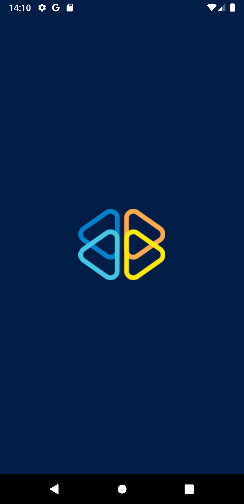
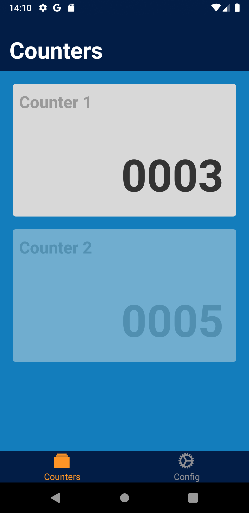
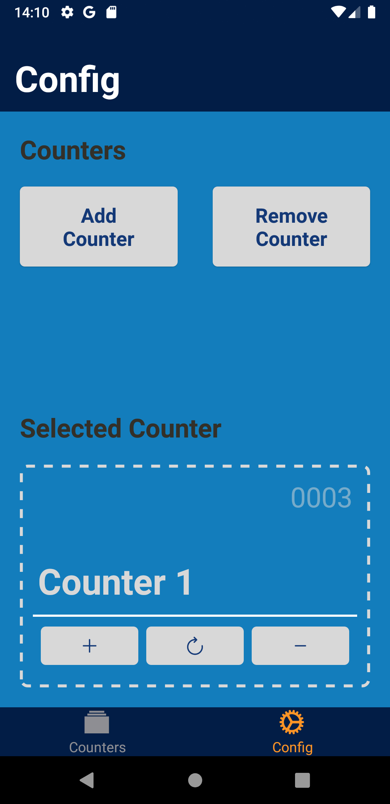
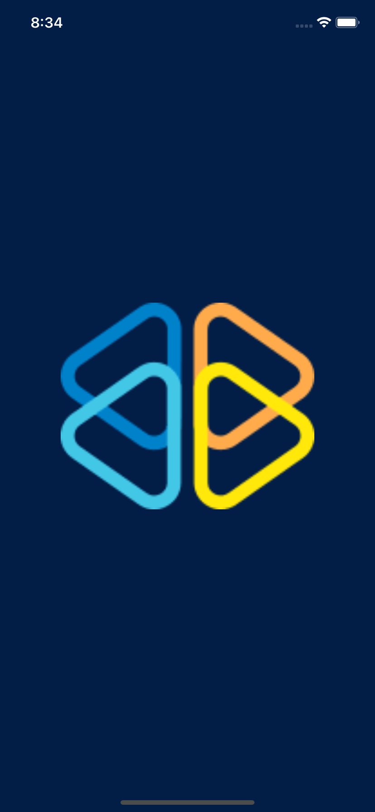
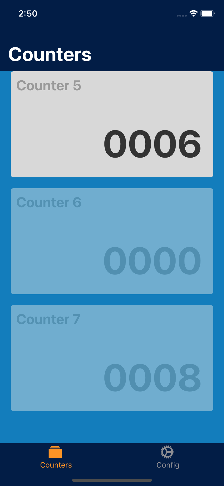
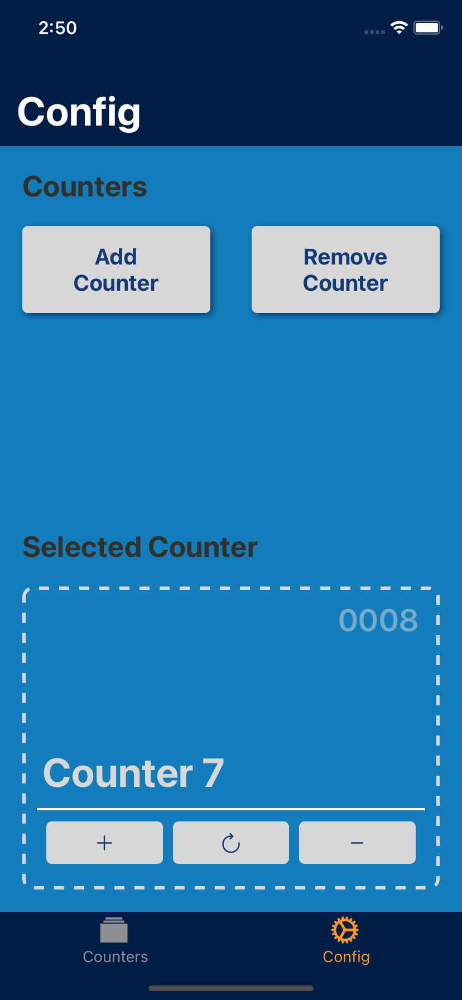

# CountersApp

- [CountersApp](#countersapp)
  - [SOLUÇÃO](#solução)
  - [FUNCIONAMENTO](#funcionamento)
  - [INSTALAÇÃO](#instalação)
  - [COMO RODAR](#como-rodar)
  - [SCREENSHOTS](#screenshots)

## SOLUÇÃO

Projeto criado com o comando `npx react-native init CountersApp` utilizando a versão `0.63.4`. Segue as definições do [desafio](https://pasteapp.com/p/6RjvwOaUa4g?view=tmkvJNHNzPp).

Roda em dispositivos Apple (iOS) e em Android.

## FUNCIONAMENTO

Ao abrir o app, num primeiro momento, virá sem nenhum contador na tab `Counters`.

Para adicionar um contador, é necessário ir até a tab `Config` e adicionar um novo contador, ao fazer essa acão ele já vai adicionar o novo ao selecionado.
Na mesma tela, é possível incrementar, resetar e decrementar (respectivamente, nos botões abaixo), apartir do controlador do contador.

Os estados são persistidos no storage do device.

> Foi utilizado context pelo fato do projeto ser pequeno, e de não ter visto a necessidade de utilizar `redux` e não era um requerimento do desafio.

## INSTALAÇÃO

Requisitos:

- [NodeJS](https://nodejs.org/en/download/)
- [React-native](https://facebook.github.io/react-native/docs/getting-started)
- **XCode**[1], ou o **Android Studio**[2]

Primeiro, baixar e instalar o NodeJS na versão LTS.

Instalação para dispositivos iOS

Após a conclusão do comando anterior, deve-se baixar e instalar o xcode\* com o `command-line tools` instalado.

\* Para mais informações, abrir a documentação do react-native abaixo.

Instalação para dispositivos Android

Após a conclusão do comando anterior, é necessário baixar e instalar o Android Studio e também criar um emulador\*.

\* Para mais informações, abrir a documentação do react-native abaixo.

[Documentação do React-Native](https://facebook.github.io/react-native/)

> [1] Somente para máquinas Mac

> [2] Para máquinas Mac/Windows/Linux

## COMO RODAR

Após obter o repositório do projeto, por clone (com o comando `git clone https://github.com/filipepiresg/counterapp`) ou download, deverá ser feito o download das dependências do projeto através do comando `yarn install` no terminal.

Se tudo estiver dado certo, o projeto já deve estar funcionando perfeitamente e para rodar tem que utilizar o comando `npx react-native run-ios` ou `npx react-native run-android` para dispositivos iOS e android, respectivamente.

 
Caso seja utilizado o android, é necessário abrir o emulador antes de rodar o projeto

Após ter instalado no dispositivo, pela primeira vez, não é necessário rodar esse comando (pois demora demais) podemos simplesmente rodar o comando `npx react-native start` para que o bundler inicie rapidamente.

## SCREENSHOTS

---
